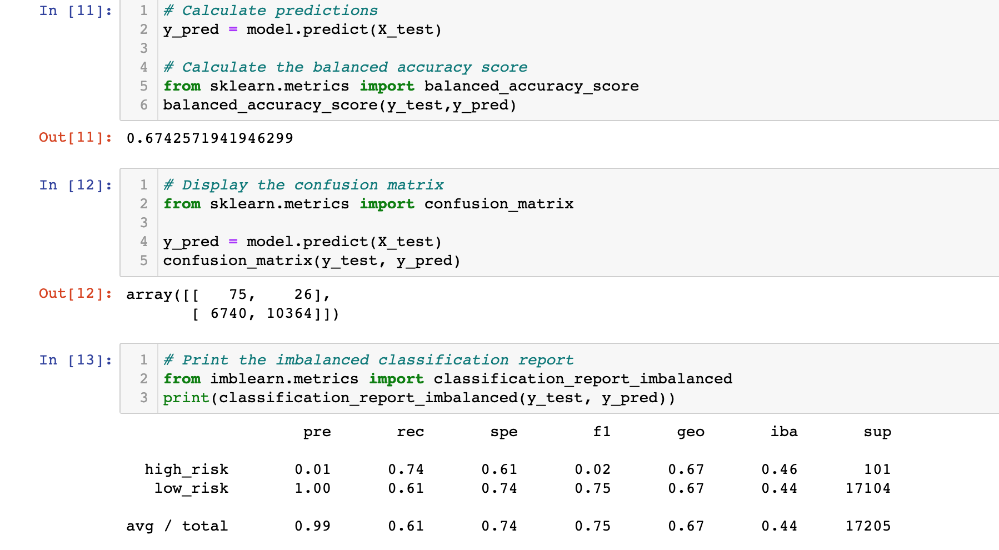
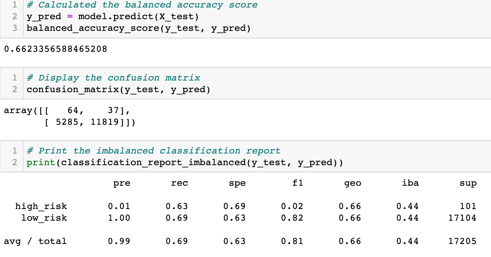
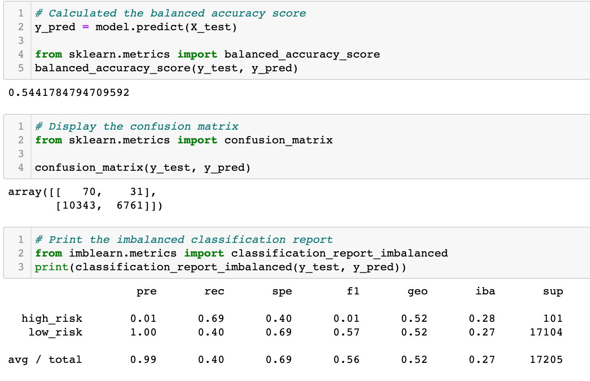
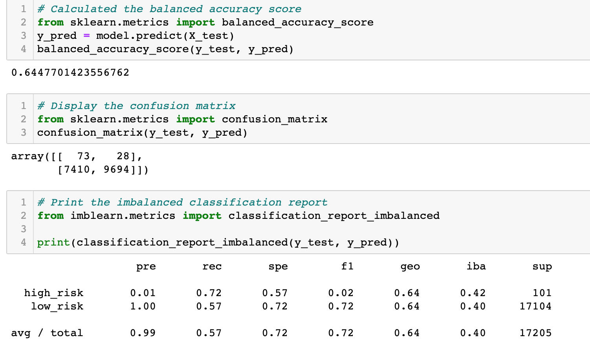
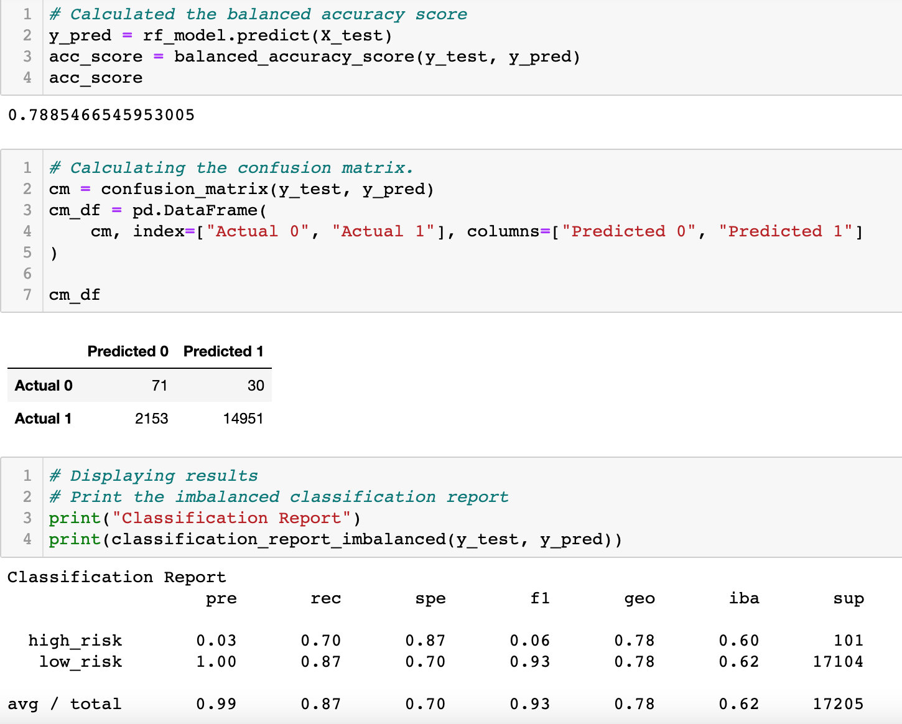
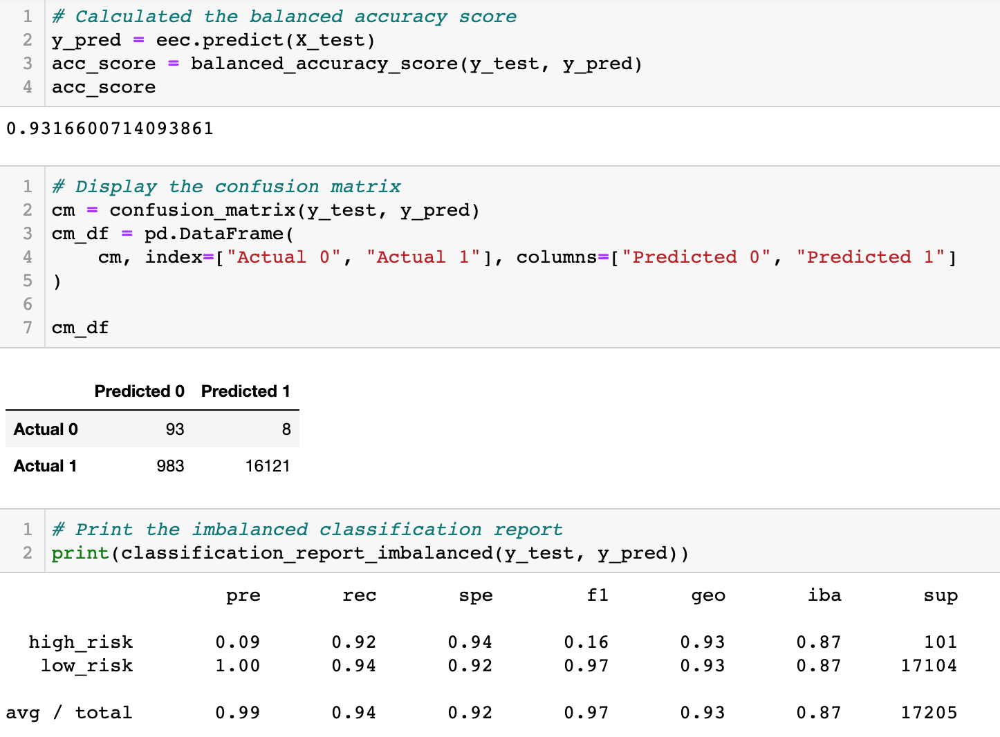

# Credit_Risk_Analysis

# **Purpose**
A dataset was provided from LendingClub, a peer-to-peer lending service company. Machine learning is applied to assess credit card risk. Since credit risk contains unbalanced classification, with good loans far outnumbering bad or risky loans, multiple techniques are used to train and evaluate predictive models. The models are compared to determine which one is most accurate at predicting credit card risk.

## **Goal**
- Use Resampling Models to Predict Credit Risk.
- Use the SMOTEENN Algorithm to Predict Credit Risk.
- Use Ensemble Classifiers to Predict Credit Risk.
- A Written Report on the Credit Risk Analysis (README.md).

## **Resources**
- Dataset: LoanStats_2019Q1.csv
- Software: Pandas, scikit-learn,imblearn, Supervised Machine Learning, Jupyter Notebook, Python

## **Results**
First, imbalanced-learn and the scikit-learn libraries were used to create three machine learning models by using resampling. The oversampling RandomOverSampler, SMOTE algorithm, and the undersampling ClusterCentroids algorithm were employed.The three models resampled the dataset, displayed the count of the target classes, trained a logistic regression classifier, calculated the balanced accuracy score, generated a confusion matrix, and a classification report. The output of each model was evaluated to determine which one was better at predicting risk. 

In Random Oversampling, data points of the minority class are randomly selected and added to the training set until the majority and minority classes are equal.

#### Random oversampling result:
- Balanced accuracy scores: .67
- Precision and: High Risk: .01 and Low Risk: .74
- Recall scores: High Risk 1 and Low Risk: 61

 

The Synthetic minority oversampling technique (SMOTE) is another oversampling approach. In SMOTE the size of the minority is increased by interpolating data points and adding those values to the minority class until it is balanced with the majority. 

#### SMOTE oversampling result:
- Balanced accuracy scores: .66
- Precision and: High Risk: .01 and Low Risk: .63
- Recall scores: High Risk: 1 and Low Risk: .69

 

Cluster centroid is similar to SMOTE, however it is a form of undersampling. The algorithm identifies clusters of the majority class, called centroids, then chooses data points that are representative of the clusters. The majority class is reduced to the size of the minority class in this way.

#### Undersampling with Cluster Centroids result:
- Balanced accuracy scores: .54
- Precision and: High Risk: .01 and Low Risk: .69
- Recall scores: High Risk: 1 and Low Risk: .4

 

Next a combinatorial approach of over- and undersampling with the SMOTEENN algorithm was used. The same process was applied to this model to determine if it was better at predicting credit risk than the resampling methods.

SMOTEENN is a combination of both oversampling and undersampling. First the minority class is oversampled with SMOTE. However, the data can be greatly impacted by outliers so an undersampling step is added, removing some of each class's outliers from the dataset. Create more distinct classes.

#### Combination sampling with SMOTEENN result:
- Balanced accuracy scores: .64
- Precision and: High Risk: .01 and Low Risk: .72
- Recall scores: High Risk: 1 and Low Risk: .57

 

Lastly, the imblearn.ensemble library was used to train and compare two different ensemble classifiers, BalancedRandomForestClassifier and EasyEnsembleClassifier. Both are models that reduce bias. The same methods were applied to these models and the results were evaluated to determine which was better at predicting credit risk. 

In BalancedRandomForestClassifer, a random forest algorithm samples the data and builds multiple smaller decision trees. Each tree is built from a random subset of features making it simple and weaker, however they can be combined to create a strong learner.

#### BalancedRandomForestClassifier result:
- Balanced accuracy scores: .79
- Precision and: High Risk: .03 and Low Risk: .7
- Recall scores: High Risk: 1 and Low Risk: .87

 

In EasyEnsembleClassifier, the algorithm applies random under-sampling. The method iteratively selects a random subset and makes an ensemble of the different sets.

#### EasyEnsembleClassifier result:
- Balanced accuracy scores: .93
- Precision and: High Risk: .09 and Low Risk: .92
- Recall scores: High Risk: 1 and Low Risk: .94

 

## Summary 
Precision is the measure of how reliable a positive classification is. A low precision is indicative of a large number of false positives.
A low recall, on the other hand, is indicative of a large number of false negatives. In this case, that would be financially detrimental to Lending Club and is the reason that metric holds more weight in this study than precision. 
Both the oversampling and undersampling techniques produced models with low accuracy and lower recall. The SMOTEENN combination method also had similar results to the previous methods. 
While the Balanced Random Forest has the second highest results, the Easy Ensemble Classifier method has the highest accuracy and highest recall. For this reason, this model is preferred. 

However, there are a couple important factors to note with this recommendation:

- Typically, when a model reaches an accuracy score close to perfect or 1, it raises suspicion of overfitting. Overfitting refers to an instance in which the patterns learned by the model are too specific to a single dataset and cannot be generalized to other datasets.
While decision trees are prone to overfitting, bootstrap aggregation works to minimize this risk by aggregating many weak into strong learners and smooths out their predictions. However, it is not immune to overfitting.
- It is also important to note that the data has not been scaled. Meaning, features with larger numbers can have a disproportionate impact on the model. It would be interesting to see how the results of the models would differ if the features were all scaled. 
